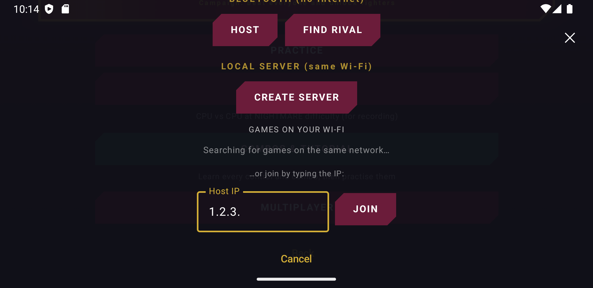
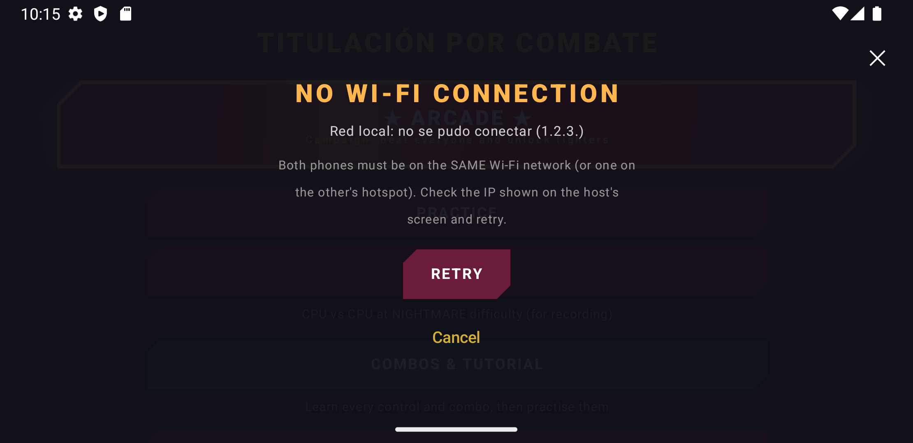
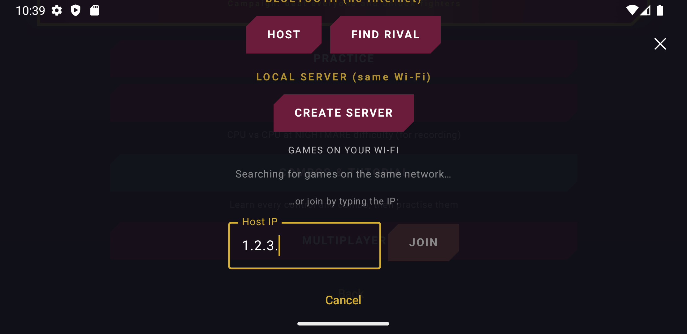
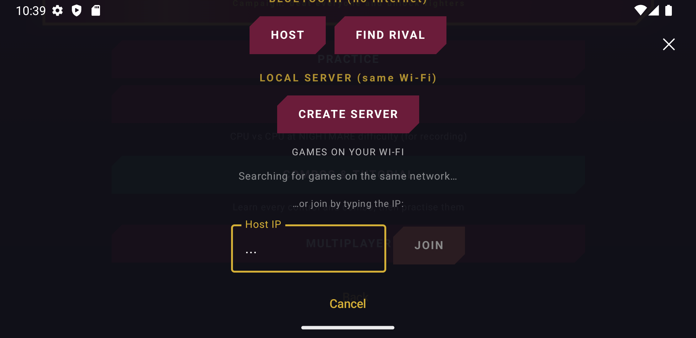
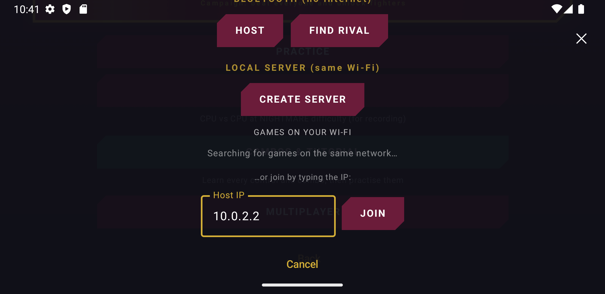
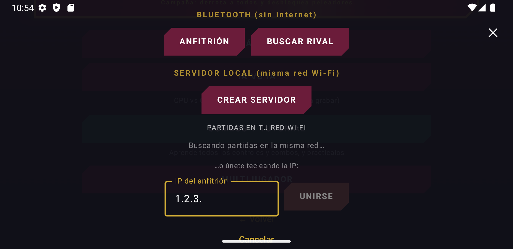

# Primer examen parcial — Pull Request con QA en PolitecnicoOpenWorld

## Portada

- **Nombre:** Jesús Ángel González Arellano
- **Usuario de GitHub:** [jesusGoliat](https://github.com/jesusGoliat)
- **Grupo:** 7CV4
- **Asignatura:** Desarrollo de aplicaciones móviles nativas
- **Profesor:** Gabriel Hurtado Avilés
- **Fecha de entrega:** jueves 1 de octubre de 2026

---

## Estructura del repositorio

```text
README.md        Índice de la entrega
docs/pruebas.md  Criterios, riesgos, entorno, fichas CP-01..CP-07, CI, hallazgos y dictamen
docs/bitacora.md Commits, casos ejecutados, revisiones y uso de IA
img/             Capturas (00–09 = base, 20+ = rama) y logs de logcat/pruebas
```

---

## Resumen

| Elemento | Valor |
|----------|-------|
| Equipo / usuario | Jesús Ángel González Arellano / [jesusGoliat](https://github.com/jesusGoliat). El examen es individual: cada integrante entrega su propio PR |
| **Pull Request** | [gabrielhuav/PolitecnicoOpenWorld#172](https://github.com/gabrielhuav/PolitecnicoOpenWorld/pull/172) (Ready for review) |
| Issue | [jesusGoliat/PolitecnicoOpenWorld#1](https://github.com/jesusGoliat/PolitecnicoOpenWorld/issues/1) |
| SHA base | [`7ed3253`](https://github.com/gabrielhuav/PolitecnicoOpenWorld/commit/7ed325393f82872c2be94ff2ada46948efa19152) (`main` del original) |
| **SHA final = SHA probado** | [`170802a`](https://github.com/jesusGoliat/PolitecnicoOpenWorld/commit/170802a5898f0c7b1d7d145df28fc1a035e27d29). Los commits posteriores de este repo son solo documentación |
| Matriz de pruebas | [docs/pruebas.md](docs/pruebas.md) |
| Bitácora | [docs/bitacora.md](docs/bitacora.md) |

---

## Objetivo y alcance

**Defecto corregido.** En «Titulación por Combate → Multijugador → LAN», el botón
**UNIRSE / JOIN** se habilitaba con solo contar tres puntos en el campo de IP. Valores
como `1.2.3.` o `a.b.c.d` lanzaban conexiones imposibles que terminaban en un error de
red engañoso.

**Cambio** (3 archivos):
- Nueva función pura `SfLanIp.esIpv4Valida`: 4 octetos entre 0 y 255, sin ceros a la izquierda.
- Un filtro de entrada para el campo.
- Su uso en `SfOnlineOverlays.kt`.
- 12 pruebas unitarias.

**Fuera de alcance:** el código de sala, la lógica de conexión LAN e IPv6.

| Criterio | Resultado |
|----------|-----------|
| CA1: una IPv4 válida habilita UNIRSE e inicia la conexión | ✅ CP-01, CP-06 |
| CA2: un valor inválido deja UNIRSE deshabilitado y no conecta | ✅ CP-02, CP-06, CP-07 |

---

## Matriz de pruebas

| ID | Categoría | Estado |
|----|-----------|--------|
| CP-01 | Ruta feliz: IP válida y conexión TCP real a `10.0.2.2:47645` | ✅ |
| CP-02 | Límite: 7 entradas inválidas dejan JOIN deshabilitado y 0 intentos de conexión | ✅ |
| CP-03 | Regresión: crear servidor, Cancelar y código de sala | ✅ |
| CP-04 | Navegación y estado: Home/volver, Atrás y recreación de la actividad | ✅ |
| CP-05 | Accesibilidad: fuente 1.3, árbol de accesibilidad y TalkBack (parcial) | ✅ |
| CP-06 | Entorno: app en español | ✅ |
| CP-07 | Unitaria: `SfLanIpTest` 12/12; 125 + 229 pruebas con 0 fallos | ✅ |

Las fichas completas, con autor, fecha, SHA, dispositivo, pasos, esperado, real y
evidencia, están en [docs/pruebas.md](docs/pruebas.md).

---

## Evidencias

**Antes (base `7ed3253`): con `1.2.3.` el botón JOIN queda habilitado.**



**Antes: al pulsarlo, la app intenta conectar a una dirección imposible y muestra un error de red.**



**Después (`170802a`, CP-02): con `1.2.3.`, JOIN queda deshabilitado y no hay intentos de conexión.**



**Después (CP-02): las letras se filtran (`a.b.c.d` queda en `...`).**



**Después (CP-01): una IP válida habilita JOIN y se abre la conexión real (ver el [logcat](img/logs/32-cp01-rama-logcat-join-10.0.2.2.txt)).**



**Después (CP-06): con la app en español, UNIRSE se comporta igual.**



---

## Checks

- **PR Quality Gate en el PR #172:** ⏸️ `action_required`. Espera la aprobación del mantenedor; es un bloqueo externo.
- **El mismo workflow en el fork:** detekt ✅. `unit-tests` ❌ por `MAPS_API_KEY` vacío, un fallo preexistente que se reproduce en la base.
- **En local, con el mismo comando del CI:** ✅ build, pruebas y detekt.

El detalle está en [docs/pruebas.md §5](docs/pruebas.md#5-checks-de-ci).

---

## Revisión

| Rol | Enlace |
|-----|--------|
| Revisión recibida (Javier-Gamez, sobre `170802a`) | [revisión](https://github.com/gabrielhuav/PolitecnicoOpenWorld/pull/172#pullrequestreview-5382926923) · [mi respuesta](https://github.com/gabrielhuav/PolitecnicoOpenWorld/pull/172#issuecomment-5936751948). Una nota no bloqueante, sin cambios de código |
| Revisión que hice al PR #170 (luisAgt, `b33b0db`) | [revisión](https://github.com/gabrielhuav/PolitecnicoOpenWorld/pull/170#pullrequestreview-5382923375) |
| Revisión que hice al PR #148 (Javier-Gamez, `92dddec`) | [revisión](https://github.com/gabrielhuav/PolitecnicoOpenWorld/pull/148#pullrequestreview-5383208475) |

---

## Dictamen

**Recomiendo integrar el PR.** No se encontraron defectos introducidos por el cambio.

**Riesgos que permanecen:**
- no se jugó una partida LAN con dos teléfonos;
- TalkBack se verificó solo en parte;
- el CI del original no ha corrido.

Los hallazgos preexistentes (H-02 a H-04) están documentados en
[docs/pruebas.md §6](docs/pruebas.md#6-hallazgos).

---

## Conclusiones

Antes de este examen pensaba en el QA como «probar que funciona» al final. Lo que
más me sirvió fue escribir los criterios y los riesgos **antes** de tocar el código.
Así supe exactamente qué capturar en la versión base, y la comparación antes/después
salió casi sola.

Lo que más me sorprendió fue que los problemas más difíciles no estaban en mi cambio
sino en el entorno: `./gradlew` no funciona en un clon limpio, y una `MAPS_API_KEY`
vacía rompe la compilación. Eso me obligó a separar con evidencia lo que ya fallaba
de lo que introduce el PR, en vez de culpar a mi cambio o desactivar el check.

---

## Referencias (APA)

- Android Developers. (s.f.). *Android Debug Bridge (adb)*. https://developer.android.com/tools/adb
- GitHub. (s.f.). *Approving workflow runs from public forks*. https://docs.github.com/en/actions/managing-workflow-runs-and-deployments/managing-workflow-runs/approving-workflow-runs-from-public-forks
- Hurtado Avilés, G. (2026). *PolitecnicoOpenWorld* [Repositorio de código]. GitHub. https://github.com/gabrielhuav/PolitecnicoOpenWorld
- Postel, J. (Ed.). (1981). *Internet Protocol* (RFC 791). IETF. https://www.rfc-editor.org/rfc/rfc791
